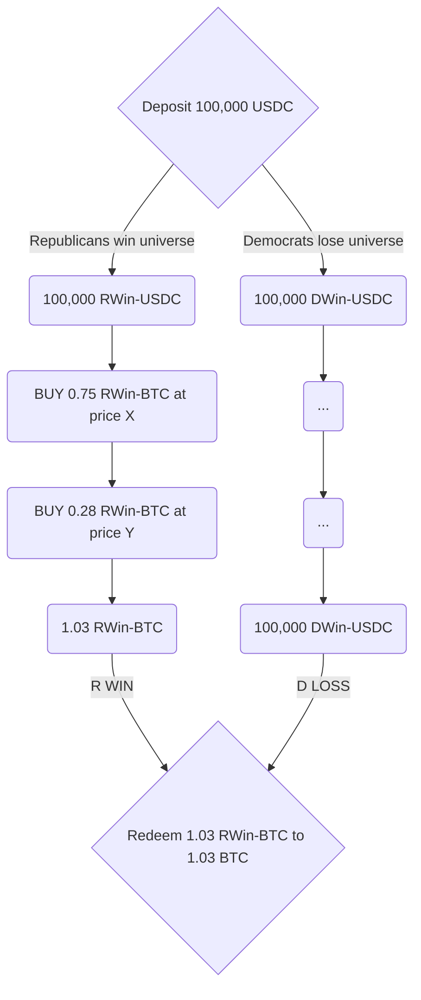

Lightcone extends financial markets to enable something that's never existed before: the ability to trade in parallel hypothetical universes, where each universe represents a determinstic reality with a guaranteed event outcome.

In simpler words, **trade (\$XYZ) if (Outcome A) is a given.**

Enter positions based on the outcome's **impact** expectations alone, while disregarding its probability of occurence.

This creates an entirely new design space for portfolio management and trading strategies.

Let's continue our previous example:

<Columns cols={2}>
  <Note icon="r" color="#DC9BF2">
    **BTC** in the universe where **Republicans win** the 2026 elections
  </Note>
  <Note icon="d" color="#45ACF8">
    **BTC** in the universe where **Democrats win** the 2026 elections
  </Note>
</Columns>

In practice, behind the scenes this market creates 4 new assets, trading across 2 orderbooks:

<Columns cols={2}>
  <Note icon="r" color="#DC9BF2">
    **Republicans win** orderbook:\
    \
    `RWin-BTC / RWin-USDC`
  </Note>
  <Note icon="d" color="#45ACF8">
    **Democrats win** orderbook:\
    \
    `DWin-BTC / DWin-USDC`
  </Note>
</Columns>

---

**The Mechanism's underbelly**

If you deposit 1 USDC, you receive two tradable tokens:

- 1 `RWin-USDC` (a representation of USDC that becomes real if Democrats win the middterms)
- 1 `DWin-USDC` (a representation of USDC that becomes real if Democrats win the middterms)

Similarly, if you deposit 1 BTC, you receive two tradable tokens:

- 1 `RWin-BTC` (a representation of BTC that becomes real if Democrats win the middterms)
- 1 `DWin-BTC` (a representation of BTC that becomes real if Democrats win the middterms)

An impact market is created by pairing two of these _universe tokens_ in an orderbook:

<Note icon="r" color="#DC9BF2">
  `RWin-BTC`/`RWin-USDC`
</Note>

<Note icon="d" color="#45ACF8">
  `DWin-BTC`/`DWin-USDC`
</Note>

Both pairs trade simultaneously at different floating prices. When the elections conclude, tokens in the winning universe will become redeemable 1:1 for real USDC and BTC.\
All tokens on the losing side will become irrelevant and worthless.

---

**Picking a universe**

We must emphasize that on lightcone, users don't try to pick the winning universe as they do on prediction markets. Instead, they decide which universe they want to trade assets _in._

In fact a more accurate terminology would be a _materliazing universe_ and a _non-materializing universe_.

Since a 1 USDC deposit creates representations of 1 USDC on both sides (in what is called a _split_), users can trade their _RWin_ tokens, and leave their _DWin_ tokens as-is -- not taking any position.

In that case, if Republicans win, their trades _materialize_ into spot. However, If Democrats win, their trades simply don't matter; they will redeem their still intact DWin tokens, equal to their original deposit into the market, 1:1 back into their corresponding spot tokens. As if nothing ever happened!

You can see how **probability is removed from the trade**. You don't care about _if_ the event happens, only about _impact_ when it does.

