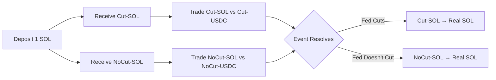

## What is Trading on Lightcone?

On Lightcone, you don't trade *whether* an event will happen. You trade *what happens to assets* when specific events occur.

Think of it this way: when you deposit 1 SOL, you receive two tradable tokens:
- 1 **Cut-SOL** (SOL in the universe where Fed cuts rates)
- 1 **NoCut-SOL** (SOL in the universe where Fed doesn't cut)

Both tokens trade simultaneously at different prices. When the event resolves, only tokens in the winning universe become redeemable for real SOL. The other universe goes to zero.

## Why This Changes Everything

**You only pay for your hedge if the event actually happens.**

Traditional hedges cost you regardless of outcome. With Lightcone:
- If the risk event occurs → you already protected yourself
- If the risk event doesn't occur → the hedge cost you nothing

This is the core insight: **probability is removed from the trade**. You don't care about *if* the event happens, only about *impact* when it does.

## A Simple Trade

Let's say you're holding BTC and worried about potential regulatory action against major exchanges.

### Step 1: Deposit Your BTC

Deposit 5 BTC into the "Regulatory Action" market. You immediately receive:
- 5 **Action-BTC** (trades in universe where action occurs)
- 5 **NoAction-BTC** (trades in universe where no action occurs)

### Step 2: Trade in One Universe

You believe regulatory action would crater BTC prices, so you sell your Action-BTC:
- Sell 5 Action-BTC for 450,000 Action-USDC (at $90k per BTC)
- Keep your 5 NoAction-BTC

### Step 3: Wait for Resolution

**Scenario A - Regulatory action happens:**
- Your 450,000 Action-USDC becomes real USDC
- You successfully hedged before the crash
- Your NoAction-BTC expires worthless

**Scenario B - No regulatory action:**
- Your 5 NoAction-BTC becomes real BTC
- You kept your full position
- The hedge cost you $0 in premium

<Note>
You can trade these tokens back and forth at any time before settlement. Changed your mind? Buy back your Action-BTC or rebalance between universes dynamically.
</Note>

## Key Differences from Prediction Markets

| | Prediction Markets | Lightcone |
|---|---|---|
| **What you trade** | Probability of event | Asset price given event |
| **Payout** | Fixed $1 if correct | Actual asset value |
| **If event doesn't occur** | Lose your stake | Keep your original position |
| **Hedging** | Indirect correlation | Direct conditional exposure |

<Tip>
**Unlike buying put options**, you don't pay upfront premium. The "cost" only materializes if the event you're hedging against actually happens.
</Tip>

## Understanding Universe Tokens

Think of universe tokens as conditional versions of the underlying asset:
- They trade like the real asset would in that specific scenario
- Their prices reveal the market's view on impact (not probability)
- You can hold positions in multiple universes simultaneously

**Example:** If Cut-SOL trades at $185 and NoCut-SOL trades at $155, while spot SOL is at $168, the market is telling you:
- Rate cuts would push SOL up ~10%
- No cuts would push SOL down ~8%
- Current price reflects both possibilities weighted by their odds

## Common Trading Strategies

### The Pure Hedge
Sell in the universe where you expect adverse impact, hold in the other. Pay only if the risk materializes.

### The Conviction Bet
Sell in one universe and buy more in the other if you have strong views on differential impact.

### The Conditional Entry
Buy assets in a specific universe at prices you find attractive, conditional on events you're tracking.

### Dynamic Rebalancing
Adjust your positions across universes as events develop and conditional prices shift.

## Getting Started

1. **Deposit** — Put your asset into a Lightcone market
2. **Trade** — Buy or sell universe tokens based on your view of conditional impacts
3. **Manage** — Rebalance across universes as needed
4. **Redeem** — When the event resolves, redeem winning universe tokens for real assets

The mechanics are simpler than they sound. You already understand how to trade. Lightcone just lets you do it conditionally.

<Card title="Ready to trade?" icon="chart-line-up" href="https://lightcone.xyz">
  Launch the app and explore live markets
</Card>
