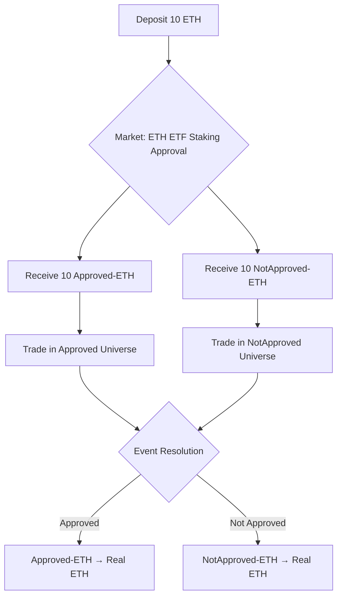

## Trading Assets in Parallel Universes

Lightcone introduces a fundamentally new way to trade: you can take positions on assets *conditional* on specific events, without having to bet on whether those events will occur.

When you trade on Lightcone, you're not trading event probabilities. You're trading actual assets as they would exist in different future scenarios.

## The Core Mechanic: Asset Splitting

Every Lightcone market splits your deposited assets into universe-specific tokens. Here's how it works:

**Deposit → Split → Trade → Settle**

When you deposit 10 ETH into a market based on ETH staking approval for ETFs, you receive:
- 10 **Approved-ETH** tokens
- 10 **NotApproved-ETH** tokens

Both trade simultaneously against USDC in their respective universes. Each has its own orderbook and price discovery.

## What Makes This Different

Traditional prediction markets let you bet on *whether* staking gets approved. You buy YES or NO tokens at prices that reflect probability.

Lightcone lets you trade *what ETH will be worth* if staking is approved versus if it isn't. You trade the asset itself in conditional form.

**The key difference:** When you're right on a prediction market, you get $1. When you're right on Lightcone, you get the asset at the price you traded it for.

## A Detailed Example: Hedging Protocol Risk

Imagine you hold 100 SOL and you're concerned about a potential exploit of a major Solana DeFi protocol. You don't want to sell your SOL entirely, but you want protection if the worst happens.

### Step 1: Enter the Market

Navigate to the "Major Protocol Exploit" market and deposit your 100 SOL.

You immediately receive:
- 100 **Exploit-SOL** (SOL in the universe where an exploit occurs)
- 100 **NoExploit-SOL** (SOL in the universe where no exploit occurs)

Your SOL is now "cloned" across both possible futures.

### Step 2: Execute Your Hedge

You check the orderbooks:
- **Exploit-SOL** is trading at $120 per token
- **NoExploit-SOL** is trading at $175 per token
- **Spot SOL** is currently at $165

The market is pricing in that an exploit would crash SOL to ~$120, while no exploit keeps it around $175.

You decide to hedge by selling your Exploit-SOL:
- Sell 100 Exploit-SOL for 12,000 Exploit-USDC (at $120 each)
- Hold your 100 NoExploit-SOL

### Step 3: Understanding Your Position

You now have two separate positions in two parallel universes:

**Universe 1 (Exploit occurs):**
- 12,000 Exploit-USDC
- 0 Exploit-SOL

**Universe 2 (No exploit):**
- 0 NoExploit-USDC
- 100 NoExploit-SOL

### Step 4: What Happens at Settlement

**Scenario A - An exploit happens:**

Reality collapses into Universe 1. Your Exploit-USDC becomes real USDC. You've successfully preserved $12,000 of value instead of watching your SOL crash to $120 per token in real-time.

Meanwhile, your NoExploit-SOL expires worthless because that universe didn't materialize.

**Scenario B - No exploit occurs:**

Reality collapses into Universe 2. Your NoExploit-SOL becomes real SOL, which you can now withdraw or keep trading. You maintained your full 100 SOL position.

Meanwhile, your Exploit-USDC expires worthless because that universe didn't materialize.

**The crucial insight:** In Scenario B, the hedge cost you nothing. No premium paid upfront, no theta decay. The "cost" only manifested in the universe where you needed the protection.

## Dynamic Position Management

Here's where it gets interesting: you can trade these universe tokens back and forth *before* the event resolves.

### Changing Your Mind

Two weeks after setting up your hedge, positive news emerges about the protocol's security. Exploit-SOL starts trading higher at $145, and NoExploit-SOL is at $180.

You can now:
- Buy back some or all of your Exploit-SOL at $145 (you sold at $120)
- Capture the difference as profit
- Rebalance your exposure across universes

### Rebalancing Strategy

You don't have to be all-in on one universe. You can:
- Sell 70% of your Exploit-SOL, keep 30%
- Sell 30% of your NoExploit-SOL, keep 70%
- Create any custom exposure profile you want

Every trader in the market is constantly revealing their view on conditional asset prices through their bids and asks.

<Note>
**Capital Efficiency**: Your initial deposit creates tokens in *both* universes. You're not splitting your capital — you're replicating it. The same collateral backs positions across all possible futures.
</Note>

## Reading the Market Signal

Universe token prices reveal information that doesn't exist anywhere else: *the market's view on asset impact, isolated from event probability*.

**Example from a geopolitical market:**

Current prices:
- Spot TSMC stock: $158
- Conflict-TSMC: $85
- NoConflict-TSMC: $195

This tells you:
- The market prices conflict impact at roughly -46% for TSMC
- The market prices continued peace at roughly +23% for TSMC
- Spot price of $158 is the probability-weighted blend of these outcomes

You can now trade based purely on whether you think the market is correctly pricing these impacts, completely independent of your view on the probability of the event.

## Common Trading Patterns

### Pattern 1: The Conditional Buy

You want to buy BTC, but only if specific macro conditions materialize.

- Deposit USDC into a Fed policy market
- Buy Easing-BTC with your Easing-USDC
- If easing happens, you get BTC at the price you traded
- If easing doesn't happen, your USDC stays intact

### Pattern 2: The Spread Trade

You think the market is overpricing the impact differential between outcomes.

- Sell Outcome-A-ETH at $3,200
- Buy Outcome-B-ETH at $2,600
- You're betting the spread will narrow
- Trade the impact itself, not the event

### Pattern 3: The Portfolio Tilt

You're long-term bullish but want to reduce exposure in specific scenarios.

- Deposit your holdings across multiple event markets
- Sell universe tokens in scenarios where you expect drawdowns
- Keep universe tokens in scenarios where you expect appreciation
- Customize your exposure profile across multiple conditional futures

### Pattern 4: The Arbitrage Scout

You notice universe token prices that seem mispriced versus spot.

- If Approved-SOL trades at $200 and NotApproved-SOL trades at $150
- And spot SOL is $160
- The implied probability is ~20% approval, ~80% rejection
- If you think the odds are wrong, you can trade the discrepancy

<Tip>
**Think of Lightcone as a conditional order book.** Instead of "buy BTC at $95k," you can express "buy BTC at $95k *if and only if* Trump announces a strategic reserve."
</Tip>

## Why Universe Tokens Trade at Different Prices

Each universe represents a different reality with different expected asset values. The prices reflect the market's collective view on what assets would be worth in that specific scenario.

Factors influencing conditional prices:
- **Direct impact**: The event's immediate effect on the asset
- **Secondary effects**: Cascading implications for broader markets
- **Correlation expectations**: How the event affects related assets
- **Liquidity and positioning**: Supply/demand for hedges in each universe

The beauty is you don't need to model all of this yourself. The market aggregates everyone's views automatically.

## Risk and Outcomes

**You make money when:**
- You trade universe tokens at favorable prices and the event resolves in your favor
- You correctly anticipate how conditional prices will move and trade the changes

**You lose money when:**
- The "wrong" universe materializes (the one where you don't have favorable positions)
- You pay more for universe tokens than what they're worth at settlement

**Key insight:** The risk profile is completely different from buying event probability. You're trading *asset exposure conditional on events*, not betting on event outcomes.

<Card title="Start Trading" icon="arrow-right" href="https://lightcone.xyz">
  Explore active markets and conditional prices
</Card>

## Advanced: Multi-Event Strategies

More sophisticated traders can chain conditional positions across multiple related events:

- Trade Fed-policy universe tokens based on inflation data
- Trade election universe tokens based on polling shifts
- Trade protocol universe tokens based on governance votes

Each market reveals new conditional price information that informs the others.

The key is remembering: you're never betting on probability. You're always trading impact.
