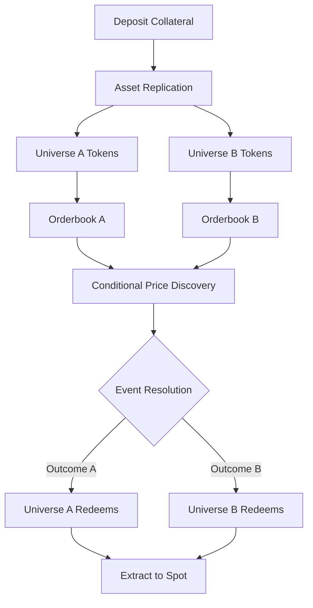

## Impact Markets: A New Primitive for Sophisticated Trading

Lightcone enables something that's never existed before: the ability to trade assets in multiple parallel realities simultaneously, isolating event impact from event probability.

This creates an entirely new design space for trading strategies. You're no longer constrained by the binary outcomes of prediction markets or the upfront costs of traditional derivatives. You can express complex conditional views with capital efficiency that wasn't previously possible.

## The Fundamental Architecture

Every Lightcone market operates on a simple but powerful principle: **asset replication across conditional states**.

When you deposit an asset, you receive equal quantities of universe-specific tokens. These aren't derivatives or synthetic claims — they're the actual asset as it would exist in each possible future state.

The critical insight: **your capital isn't split across universes, it's replicated**. A single unit of collateral backs positions in all possible outcomes simultaneously.

## What This Enables: The Strategic Landscape

### 1. Zero-Premium Conditional Hedges

Traditional hedging requires paying upfront premium (options) or accepting funding costs (perpetuals). Both cost you even if the risk never materializes.

Impact markets flip this: **you only pay if the event you're hedging actually occurs**.

**Example: Tail Risk Management**

You hold 1000 SOL ($165k at $165/SOL) and want protection against a major negative catalyst without sacrificing upside.

**Traditional approach:**
- Buy SOL put options at $140 strike
- Pay 3% premium upfront ($4,950)
- If catalyst doesn't occur, lose the entire premium
- Annual cost: ~12% of your position for rolling protection

**Impact market approach:**
- Deposit 1000 SOL into "Catalyst Event" market
- Receive 1000 Catalyst-SOL and 1000 NoCatalyst-SOL
- Sell 1000 Catalyst-SOL at $125 for 125,000 Catalyst-USDC
- Hold 1000 NoCatalyst-SOL

**Outcomes:**
- **Catalyst occurs:** You have $125k in real USDC (protected at $125/SOL floor)
- **No catalyst:** You have 1000 real SOL (full upside maintained)
- **Hedge cost if no catalyst:** $0

This isn't just cheaper — it's structurally different. The hedge premium only manifests in the universe where you needed protection.

<Note>
**Capital efficiency multiplier**: Because your collateral replicates across universes, market makers can provide liquidity without warehousing exposure in the same way. This typically results in tighter spreads than comparable option markets.
</Note>

### 2. Impact Spread Trading

One of the most sophisticated strategies: trading the *differential impact* between universes without directional exposure to the underlying.

**Example: Fed Policy Impact Spread**

Current state:
- Spot BTC: $102,000
- Cut75bp-BTC: $118,000
- Cut25bp-BTC: $108,000
- NoCut-BTC: $95,000

You believe the market is overpricing the difference between aggressive cuts (75bp) and moderate cuts (25bp). Your thesis: 25bp is enough to trigger the same risk-on sentiment.

**The trade:**
1. Deposit 5 BTC
2. Receive universe tokens across all three outcomes
3. **Sell** 5 Cut75bp-BTC at $118k = 590,000 Cut75bp-USDC
4. **Buy** additional Cut25bp-BTC at $108k
5. Keep your NoCut-BTC position

You've constructed a spread trade on impact itself. You profit if:
- The 75bp-25bp spread narrows (your thesis)
- Either cut happens and you're right about the impact compression

You lose if:
- The spread widens further
- No cuts happen and you've given up spot exposure

This is trading pure impact correlation — a strategy that didn't exist before impact markets.

### 3. Multi-Leg Conditional Strategies

Chain positions across related events to create sophisticated exposure profiles.

**Example: Conditional Sector Rotation**

Setup: You believe AI regulation will determine sector leadership between AI compute providers and traditional tech.

**Step 1: Primary Market**
- Market: "Comprehensive AI Regulation Passes"
- Deposit 50 ETH
- Receive Regulated-ETH and Unregulated-ETH

**Step 2: Conditional Sector Positioning**

**In the Regulated universe:**
- Sell Regulated-ETH for Regulated-USDC
- Use Regulated-USDC to buy Regulated-GOOGL (traditional tech benefits)

**In the Unregulated universe:**
- Sell Unregulated-ETH for Unregulated-USDC
- Use Unregulated-USDC to buy Unregulated-NVDA (AI compute benefits)

You've created a conditional sector rotation strategy. Your portfolio automatically optimizes based on which regulatory environment materializes.

<Tip>
**Strategy principle**: Impact markets let you pre-position for different macro regimes without having to react in real-time when events unfold. You can build entire conditional portfolios ahead of key events.
</Tip>

### 4. Cross-Market Arbitrage

Sophisticated traders can arbitrage between spot markets, prediction markets, and impact markets.

**The relationship:**

`Spot Price = Σ(Probability × Conditional Price)`

If you can observe:
- Spot price (S)
- Prediction market probability (P)
- Impact market conditional prices (I_A, I_B)

You can identify mispricings when the equation doesn't balance.

**Example:**
- Spot SOL: $165
- Polymarket: 40% chance of regulatory approval
- Lightcone: Approval-SOL at $210, Rejection-SOL at $140

Implied spot from conditional prices:
`(0.40 × $210) + (0.60 × $140) = $84 + $84 = $168`

The impact markets imply spot should be $168, but it's trading at $165. This creates potential arbitrage:
- Buy spot SOL at $165
- Deposit into Lightcone market
- Sell Approval-SOL at $210
- Sell Rejection-SOL at $140
- Lock in $3 profit per SOL regardless of outcome

(In practice, trading fees and liquidity constraints limit this, but the principle holds.)

### 5. Dynamic Rebalancing Strategies

Because universe tokens trade continuously before settlement, you can adjust positions as new information arrives.

**Example: Event Probability Shift Strategy**

Initial state (30 days before event):
- You deposit 100 ETH
- Sell Approval-ETH at $2,800 for 280,000 Approval-USDC
- Hold Rejection-ETH

10 days later, positive signals emerge:
- Approval-ETH now trading at $3,100
- Rejection-ETH now trading at $2,600

**Strategy adjustment:**
- Buy back 50 Approval-ETH at $3,100 (costs 155,000 Approval-USDC)
- You've captured profit on 50 ETH ($3,100 - $2,800 = $300 per ETH)
- You now have mixed exposure instead of fully hedged

You're trading the *evolution* of conditional prices, not just the final settlement.

<Card title="Advanced Pattern" icon="lightbulb">
  **Volatility Harvesting**: Some traders use impact markets to harvest volatility by repeatedly rebalancing as conditional prices fluctuate, similar to delta hedging but without paying option premium.
</Card>

### 6. Information Asymmetry Exploitation

Impact markets reveal information that sophisticated traders can monetize.

**The edge:** Most traders focus on event probability (Polymarket, news). Fewer traders have strong models for *event impact on specific assets*.

**Example: Geopolitical Impact on Supply Chains**

Market: "Major Trade Policy Shift"
- Most traders focused on probability debate
- You have proprietary analysis on how this affects semiconductor supply chains
- Conditional prices don't yet reflect your analysis

**Your trade:**
- Sell Shift-TSMC at $165 (you model it should be $135)
- Buy Shift-INTEL at $28 (you model it should be $38)
- Trade the relative impact, not the probability

You're monetizing an information edge about impact, which is less crowded than probability analysis.

## Advanced Risk Management Considerations

### Asymmetric Loss Scenarios

**Scenario:** You sell Event-A-BTC thinking it should crash on Event A, but you're wrong.

**Loss profile:**
- If Event A happens and BTC actually pumps, you sold low in the winning universe
- You're left with worthless Event-B-BTC in the losing universe
- Your loss can exceed your initial collateral value

**Mitigation:** Size positions based on your conviction about *impact*, not just event probability.

### Liquidity Fragmentation

Each universe has its own orderbook. In low-volume markets:
- Spreads can be wide
- Large positions may have significant price impact
- Emergency exits might require crossing large spreads

**Strategy:** Focus on markets with deep liquidity or trade smaller sizes in frontier markets.

### Model Risk on Conditional Pricing

You might have the right directional view on impact but wrong magnitude:
- You think Approval-SOL should be $200, it's trading at $180
- You buy, but at settlement it's actually $185
- You made money but less than expected

**Approach:** Trade impact *relative to current market pricing*, not your absolute model.

## The Institutional Playbook

For funds and sophisticated traders, impact markets enable portfolio-level strategies:

### Portfolio Hedging Without Cash Drag

Traditional approach: Hold 10-20% cash for tail risk protection
Impact market approach: Stay fully invested, hedge specific scenarios with universe tokens

**Efficiency gain:** No cash drag on returns unless hedge is needed

### Conditional Rebalancing

Instead of setting stop-losses or limit orders that execute mechanically:
- Trade into universe tokens at target prices
- If the event materializes, your rebalance is automatic
- If it doesn't, you stay in your current allocation

### Basis Trading Between Markets

Funds can capture spread between:
- Spot markets (pure asset exposure)
- Prediction markets (pure event probability)
- Impact markets (conditional asset exposure)

Each market type has different participant bases and information flows, creating structural opportunities.

<Note>
**Regulatory consideration:** Impact markets may have different regulatory treatment than prediction markets or derivatives in various jurisdictions. Consult with legal counsel about your specific use case.
</Note>

## Strategic Principles for Impact Market Trading

1. **Separate impact from probability in your analysis** — Most traders confuse the two
2. **Universe tokens can be traded dynamically** — Think continuous strategy, not set-and-forget
3. **Capital replication creates leverage without leverage** — Understand your effective exposure
4. **Liquidity is fragmented across universes** — Plan entries and exits accordingly
5. **Conditional prices reveal unique information** — Learn to read what the market is telling you
6. **Combine with other markets for complete picture** — Spot + Prediction + Impact = full information set

## Getting Started with Advanced Strategies

**Phase 1: Learn the mechanics**
- Start with simple hedges in one universe
- Observe how conditional prices move
- Understand settlement and redemption

**Phase 2: Simple spreads**
- Trade impact differentials within a single event
- Develop intuition for conditional price discovery

**Phase 3: Multi-market strategies**
- Chain positions across related events
- Build conditional portfolios
- Explore arbitrage between market types

**Phase 4: Alpha generation**
- Develop proprietary models for impact analysis
- Trade information edges in conditional pricing
- Harvest volatility through dynamic rebalancing

<Card title="Advanced Trading Interface" icon="chart-mixed" href="https://lightcone.xyz/pro">
  Access professional trading tools and analytics
</Card>

## The Future of Conditional Trading

Impact markets are a new primitive. As the ecosystem develops, expect:

- **Deeper liquidity** as market makers refine strategies
- **More complex events** with multiple conditional outcomes
- **Integration with DeFi** for composable conditional positions
- **Analytics tools** for modeling conditional price relationships
- **Institutional adoption** as funds allocate to impact market strategies

You're early to a fundamentally new way of expressing risk and return preferences. The strategies that work today may evolve as markets mature, but the core insight remains: **probability-free conditional exposure is a powerful tool for sophisticated traders**.

The question isn't whether impact markets will reshape trading — it's whether you'll be among the first to master them.
