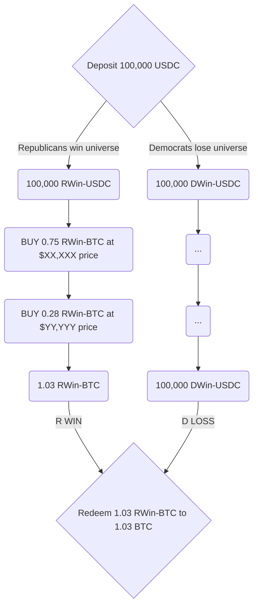

Lightcone extends financial markets to enable something that's never existed before: the ability to trade in hypothetical universes, each representing a deterministic reality in the context of a specific event.

The core premise is simple: **trade (\$XYZ) asset if (Outcome A) is a given.**

With that premise in mind, traders enter positions based on **impact** expectations alone, while disregarding the event's probability of occurrence.

This creates an entirely new design space for portfolio management and trading strategies.

---

Circling back to our previous example:

<Columns cols={2}>
  <Callout icon="r" color="#DC9BF2">
    **BTC** in the universe where **Republicans win** the 2026 elections
  </Callout>
  <Callout icon="d" color="#45ACF8">
    **BTC** in the universe where **Democrats win** the 2026 elections
  </Callout>
</Columns>

**how do we make it happen?**\
**>>into the mechanism's belly**

For every 1 USDC deposited into the market, two tokens are minted:

- <Badge size ="sm" className="badge-r">**1 RWin-USDC**</Badge> _(token that converts to real USDC only if Republicans win)_
- <Badge size ="sm" className="badge-d">**1 DWin-USDC**</Badge> _(token that converts to real USDC only if Democrats win)_

Similarly, for every 1 BTC deposited, two tokens are minted:

- <Badge size ="sm" className="badge-r">**1 RWin-BTC**</Badge> _(token that converts to real BTC only if Republicans win)_
- <Badge size ="sm" className="badge-d">**1 DWin-BTC**</Badge> _(token that converts to real BTC only if Democrats win)_

An impact market is created by pairing two of these _universe tokens_ in an orderbook.

So behind the scenes this market creates 4 new assets, trading across 2 different orderbooks:

<Columns cols={2}>
  <Callout icon="r" color="#DC9BF2">
    **Republicans win** orderbook:\
    \
    <Badge size ="sm" className="badge-r">**RWin-BTC / RWin-USDC**</Badge>
  </Callout>
  <Callout icon="d" color="#45ACF8">
    **Democrats win** orderbook:\
    \
    <Badge size ="sm" className="badge-d">**DWin-BTC / DWin-USDC**</Badge>
  </Callout>
</Columns>

Both pairs trade simultaneously at different floating prices. When the elections conclude, tokens in the winning universe will become redeemable 1:1 for real USDC and BTC, respectively.

Tokens in the losing universe will become irrelevant and worthless.

---

**Picking a universe**

We must emphasize that on lightcone, users don't try to pick the winning universe as they do on prediction markets. Instead, they decide which universe they want to trade assets _**in.**_

In-fact a more accurate term would be a _materliazing universe_ and a _non-materializing universe_.

Since a 1 USDC deposit creates representations of 1 USDC on both sides (in what is called a _split_), users can trade only their <Badge size ="sm" className="badge-r">**RWin**</Badge> tokens, while leaving their <Badge size ="sm" className="badge-d">**DWin**</Badge> tokens as-is -- not taking any position there.

[ILLUSTRATION HERE]

In that case:
1. if Republicans win, their <Badge size ="sm" className="badge-r">**RWin**</Badge> balances and trades settle into spot.
2. If Democrats win, their Republican trades simply won't matter; they will redeem their intact  <Badge size ="sm" className="badge-d">**DWin**</Badge> tokens 1:1 back into their corresponding spot tokens, getting their original deposit back in its entirety! While the <Badge size ="sm" className="badge-r">**RWin**</Badge> token trades did execute onchain, the <Badge size ="sm" className="badge-r">**RWin**</Badge> universe didn't materialize - so for this user, it's practically as if nothing ever happened.

Put another way:

You can see how **probability is removed from the trade**. You don't care about _whether_ the event happens, only about its _impact_ if it does.

